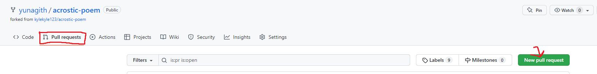
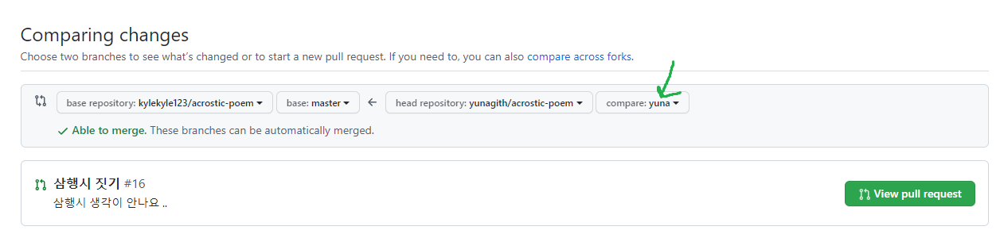

# TIL DAY 2

> 2022-05-20

## 1. .gitignore

- 특정 파일 혹은 폴더에 대해 Git이 버전 관리를 하지 못하도록 지정하는 것

#### 1) .gitignore 주의사항

- 이름은 반드시 .gitignore 로 작성한다.
- .gitignore 파일은 .git 폴더와 동일한 위치에 생성한다.
- 제외하고 싶은 파일은 git add 하기 전에 .gitignore에 작성한다.

***

## 2. clone, pull

#### 1) git clone

- 원격 저장소의 커밋 내역을 모두 가져와서, 로컬 저장소를 생성하는 명령어
- 처음 한번만 실행
- 가져오고 싶은 폴더에서 우클릭, Git Bash Here 클릭

```bash
git clone https://github.com/yunagith/word-relay.git
```

#### 2) git pull

- 원격 저장소의 변경사항을 가져와서 로컬 저장소에 입력하는 명령어

``` bash
git pull origin master
```

#### 주의사항

- git clone과 git pull은 둘 다 가져오는 명령어이지만 사용하는 용도가 다르다.
- git clone은 github에서 처음 가져올 때만 사용한다. 그 뒤부터는 git pull을 사용한다.

#### 공부하면서 내가 헷갈려했던 부분

- git push은 github로 보내는 명령어
- git pull은 github에서 가져오는 명령어

***

## 3. Branch

#### 1) git branch

``` bash
# 브랜치 목록 확인
$ git branch
# 원격 저장소의 브랜치 목록 확인
$ git branch -r
# 새로운 브랜치 생성
$ git branch [브랜치 이름] *(괄호제외)
# 특정 브랜치 삭제
$ git branch -d [브랜치 이름]
```

#### 2) git switch

``` bash
# 다른 브랜치로 이동
$ git switch [다른 브랜치 이름]
# 브랜치 생성과 동시에 이동
$ git switch -c [브랜치 이름]
```

***

### 4. 기본적인 부분

```bash
# add 인지 commit -m[]인지 완벽한지 확인
$ git status
# 로그 한줄 정리 확인
$ git log --oneline
```

***

### 5. Git workflow 

#### 1) 소유권이 없는 경우

 - 소유권이 없는 원격 저장소(github)를 fork(뜻: 그 포크맞음)를 통해 내 원격 저장소(github)로 복제한다.

 - 내 원격저장소에서 복제된 주소를 가져온다.

 - 가져오고 싶은 상위파일에서 우클릭>git bash>git clone [복제된 주소] *괄호제외

 - 가져온 파일에서 vs code로 열기

 - 우선 소유권이 없는 원격 저장소를 저장

   ```bash
   $ git remote add upstream [소유권이 없는 원격 저장소의 주소] *괄호제외
   ```

- 내가 작업할 기능에 대한 브랜치 생성과 스위치

  ```bash
  $ git branch yuna #여기서 주의 ! git branch master를 하면 안됨.
  $ git switch yuna #yuna 브랜치로 이동
  ```

- add와 commit

  ```bash
  $ git add .
  $ git commit -m "이름 지정" # 예: 끝말잇기의 경우 "첫번째 단어"와 같은..
  # 그리고 중간중간 git status로 확인하기
  ```

- 기능구현이 완료되면 복제한 내 원격 저장소로 push

  ```bash
  $ git push origin yuna # 여기서 주의! 내 원격 저장소 주소가 origin 이므로 origin으로 보내야함.
  ```

- pull request 를 통해서 내 원격 저장소의 브랜치를 소유권이 없는 원격 저장소의 master에 반영해달라는 

  요청을 보낸다. (소유권이 있는 관리자가 확인 후 반영 여부를 결정한다.)

  

- compare 부분을 브랜치 생성 시 사용한 이름으로 변경

  

- 이후 소유권이 없는 원격 저장소 관리자의 repository의 pull request 목록에서 나의 요청 확인하기.

> 관련 실습 : 삼행시 짓기 [acrostic-poem]


